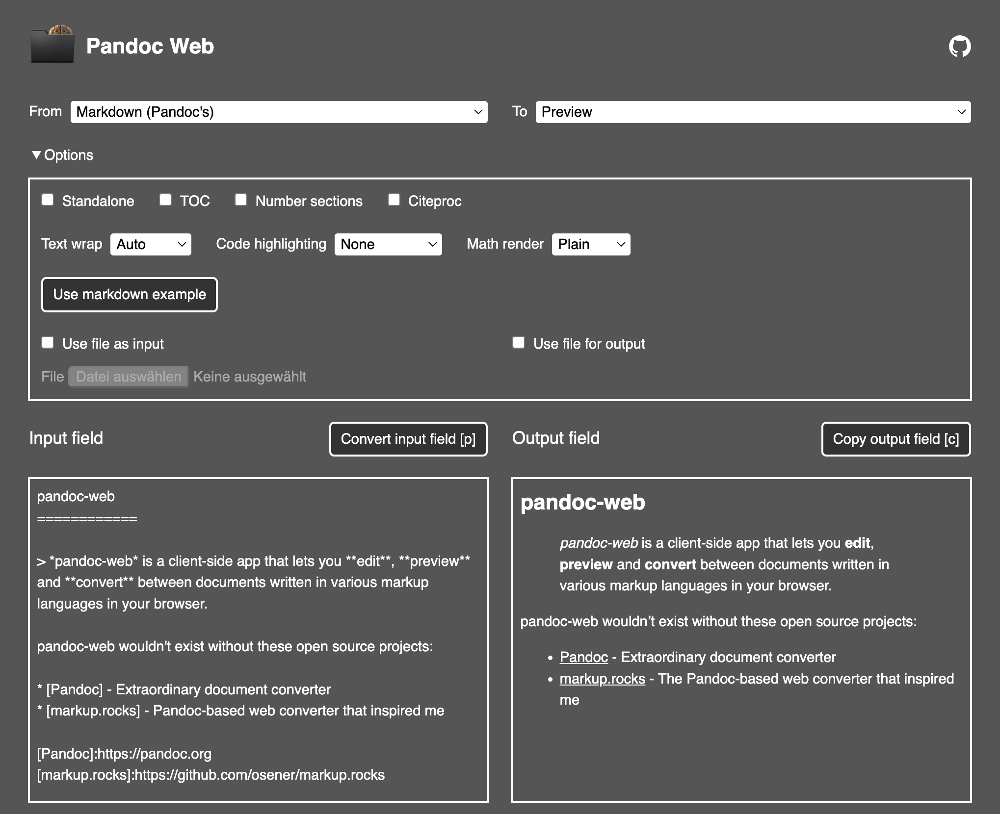

# Pandoc Web

*Pandoc Web* is a client-side app that lets you edit, preview and
convert between documents written in various markup languages in your
browser. Functions are based on [Pandoc](https://pandoc.org) your
swiss-army knife for converting files.



## Table of contents

* [Manual](#manual)
  * [Input formats](#input-formats)
  * [Output formats](#output-formats)
  * [Options](#options)
    * [Standalone](#standalone)
    * [TOC](#toc)
    * [Number sections](#number-sections)
    * [Citeproc](#citeproc)
    * [Text wrap](#text-wrap)
    * [Code highlighting](#code-highlighting)
    * [Math render](#math-render)
    * [Use markdown example](#use-markdown-example)
    * [Use file as input](#use-file-as-input)
    * [Use file for output](#use-file-for-output)
* [Installation](#installation)
  * [Prerequisites](#prerequisites)
  * [Install Pandoc Web](#install-pandoc-web)
  * [Debugging](#debugging)
* [Links](#links)

## Manual

### Input formats

<details>
<summary>
You can convert from (click to show):
</summary>

- BibLaTeX bibliography
- BibTeX bibliography
- Creole 1.0
- CSL JSON bibliography
- CSV table
- DocBook
- DokuWiki markup
- Emacs Org mode
- EndNote XML bibliography
- EPUB (file input)
- FictionBook2 e-book
- Haddock markup
- HTML
- JATS XML
- Jira/Confluence wiki markup
- JSON version of native AST
- Jupyter notebook
- LaTeX
- Markdown (CommonMark)
- Markdown (CommonMark with extensions)
- Markdown (GitHub-Flavored)
- Markdown (Multi)
- Markdown (original unextended)
- Markdown (Pandoc’s)
- Markdown PHP Extra
- MediaWiki markup
- Muse
- native Haskell
- ODT (file input)
- OPML
- reStructuredText
- Rich Text Format
- RIS bibliography
- roff man
- Textile
- TikiWiki markup
- TSV table
- TWiki markup
- txt2tags
- typst
- Vimwiki
- Word docx (file input)

</details>

### Output formats

<details>
<summary>
You can convert to (click to show):
</summary>

- Preview
- alias for jats_archiving
- AsciiDoc (modern) as interpreted by AsciiDoctor
- AsciiDoc as interpreted by asciidoc-py
- BibLaTeX bibliography
- BibTeX bibliography
- ConTeXt
- CSL JSON bibliography
- DocBook 4
- DocBook 5
- DokuWiki markup
- Emacs Org mode
- EPUB v2
- EPUB v3 book
- FictionBook2 e-book
- GNU Texinfo
- Haddock markup
- HTML
- InDesign ICML
- JATS XML, Archiving and Interchange Tag Set
- JATS XML, Article Authoring Tag Set
- JATS XML, Journal Publishing Tag Set
- Jira/Confluence wiki markup
- JSON version of native AST
- Jupyter notebook
- LaTeX
- Markdown (CommonMark)
- Markdown (CommonMark with extensions)
- Markdown (GitHub-Flavored)
- Markdown (Multi)
- Markdown (original unextended)
- Markdown (Pandoc’s)
- Markdown PHP Extra
- Markua
- MediaWiki markup
- Muse
- native Haskell
- OpenDocument
- OpenOffice text document
- OPML
- PDF
- plain text
- PowerPoint
- reStructuredText
- Rich Text Format
- roff man
- roff ms
- Slide Show - DZSlides HTML5 + JavaScript
- Slide Show - LaTeX beamer
- Slide Show - reveal.js HTML5 + JavaScript
- Slide Show - S5 HTML and JavaScript
- Slide Show - Slideous HTML and JavaScript
- Slide Show - Slidy HTML and JavaScript
- TEI Simple
- Textile
- typst
- Word docx
- XHTML 1.0 Transitional
- XWiki markup
- ZimWiki markup
- zip archive of multiple linked HTML files

</details>

### Options

You have some options. For more detailed informations see [pandocs
manual](https://pandoc.org/MANUAL).

#### Standalone

Produce output with an appropriate header and footer (e.g. a standalone
HTML, LaTeX, TEI, or RTF file, not a fragment).

This option is set automatically for PDF, EPUB, FictionBook2 e-book,
Word docx and OpenOffice text document odt output.

#### TOC

Include an automatically generated table of contents (or, in the case of
latex, context, docx, odt, opendocument, rst, or ms, an instruction to
create one) in the output document. This option checks option
‘Standalone’ as this is required.

Option ‘TOC’ has no effect on roff man, DocBook4, DocBook5 or all JATS
XML output.

#### Number sections

Number section headings in LaTeX, ConTeXt, HTML, Word docx, roff ms,
EPUB or Preview output.

#### Citeproc

Process the citations in the file, replacing them with rendered
citations and adding a bibliography. Citation processing will not take
place unless bibliographic data is supplied through the bibliography
field in metadata, or via a references section in metadata containing a
list of citations in CSL YAML format with Markdown formatting.

For more information see the [pandoc manual section on
Citations](https://pandoc.org/MANUAL#citations).

#### Text wrap

Determine how text is wrapped in the output (the source code, not the
rendered version). With `Auto` pandoc will attempt to wrap lines to the
column width (72). With `None` pandoc will not wrap lines at all. With
`Preserve` pandoc will attempt to preserve the wrapping from the source
document (that is, where there are nonsemantic newlines in the source,
there will be nonsemantic newlines in the output as well). In Jupyter
notebook (ipynb) output, this option affects wrapping of the contents of
markdown cells.

#### Code highlighting

Specifies the coloring style to be used in highlighted source code.
`None` disables syntax highlighting for code blocks and inlines. Other
options are `Pygments`, `Breeze`, `Espresso`, `Haddock`, `Kate`,
`Monochrome`, `Tango` and `Zenburn`.

#### Math render

The default `Plain` is to render TeX math as far as possible using
Unicode characters. Formulas are put inside a `span` with
`class="math"`, so that they may be styled differently from the
surrounding text if needed. However, this gives acceptable results only
for basic math, usually you will want to use another of the options
`GladTeX`, `KaTeX`, `MathJax`, `MathML` or `WebTeX`.

For more information see the [pandoc manual section on Math rendering in
HTML](https://pandoc.org/MANUAL#math-rendering-in-html).

#### Use markdown example

To just play a bit with all the options above click the button
`Use markdown example`.

#### Use file as input

Instead of typing text in the input field provide an input file.
Remember to choose the correct input format too.

The input file is sent to the server for conversion and then immediately
deleted on the server.

#### Use file for output

Normally all output will be seen on the output field. But you can create
a file by checking it. After converting you will get a download link
offered.

After conversion and sending back to the client the output file is also
immediately deleted from the server.

## Installation

### Prerequisites

Of course your server needs [Pandoc](https://pandoc.org). You find
[Pandoc installing instructions on
github](https://github.com/jgm/pandoc/blob/main/INSTALL.md).

To create PDFs you need [ConTeXt](https://wiki.contextgarden.net). You can find informations on [how to
install ConTeXt](https://wiki.contextgarden.net/Installation).

You might also like to read the security instructions at [How to
increase security for pandoc on
server](https://pandoc.org/chunkedhtml-demo/19-a-note-on-security.html).
But don't panic, these advices are implemented in the code.

### Install Pandoc Web

The easiest way to get a installation of Pandoc Web itself is to clone
this repo.

``` shell
$ git clone https://github.com/SimpelMe/pandoc-web
```

Then rename the `localConfig_example.php` to `localConfig.php` and set
both pathes to your `pandoc` and `context` on your server.

``` php
// both pathes to pandoc and to context (context is needed for pdf)
define('PATH', '/Users/me/.pandoc/bin/:/Users/me/context/tex/texmf-osx-arm64/bin/');
```

It sets the value of the servers environment variable `PATH`.

Then open `index.php` and remove two lines. Because those embed my personal website header and you don't have this code.

First remove in `<head>`:

```
<?php include dirname($_SERVER['DOCUMENT_ROOT']) . "/simpel.cc/php/head.php"; ?>
```

Second remove in `<header>`:

```
<?php include dirname($_SERVER['DOCUMENT_ROOT']) . "/simpel.cc/php/header.php"; ?>
```

### Debugging

You can get debugging infos in the output field from your servers actions. Place a file called `DEBUG` on the server.

## Links

- [Pandoc](https://pandoc.org)
- [Pandoc installing instructions on
  github](https://github.com/jgm/pandoc/blob/main/INSTALL.md)
- [ConTeXt](https://wiki.contextgarden.net)
- [How to install context](https://wiki.contextgarden.net/Installation)
- [How to increase security for pandoc on
  server](https://pandoc.org/chunkedhtml-demo/19-a-note-on-security.html)
